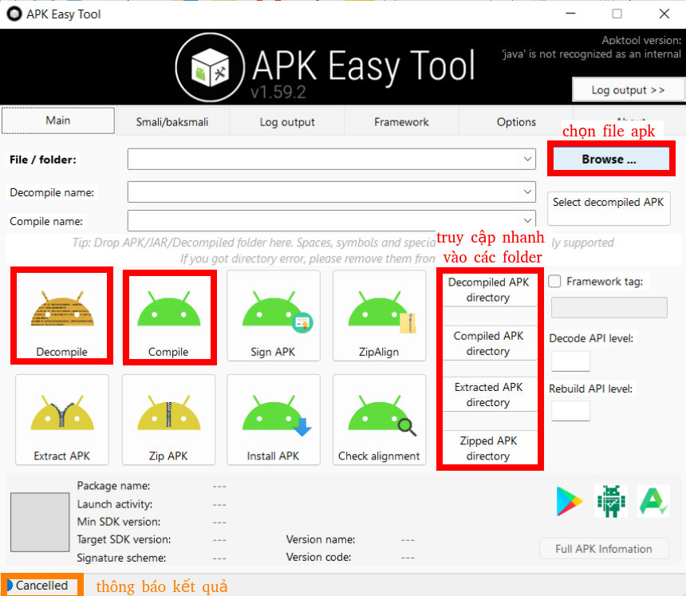
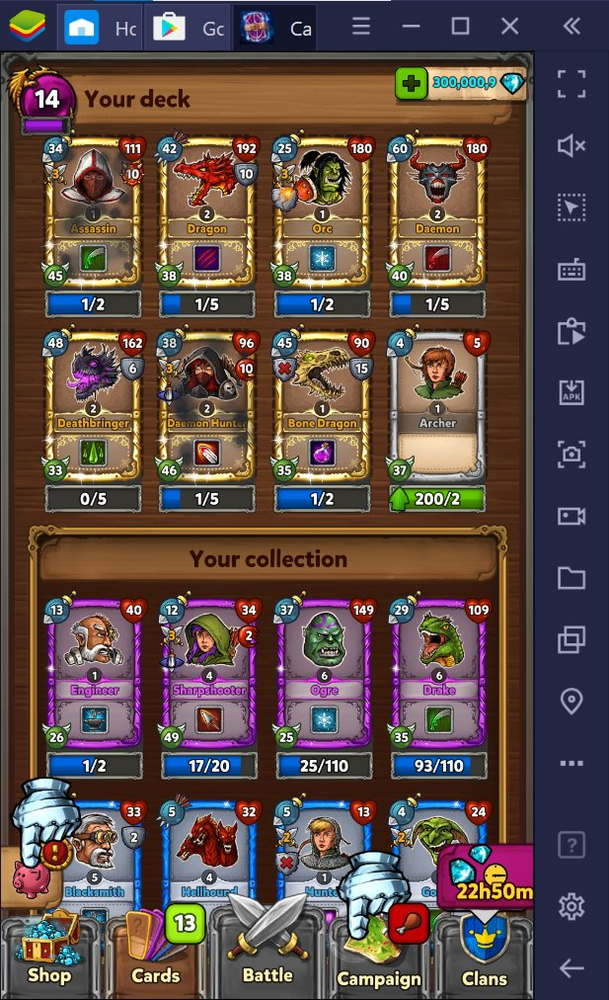

Hầu hết game hiện tại trên nên tảng Android-IOS đều được viết bằng Unity. Trong bài viết này mình sẽ viết bài viết ngắn giới thiệu cách sử dụng Dnspy để dịch ngược game và thay đổi source code của game.

### Vấn đề
Khi chơi game thì hầu như ta cần phải cày cuốc ngày đêm để được trở thành pro hoặc [pay2win](https://www.google.com/search?q=pay+to+win&sxsrf=APq-WBtU7ldCNGSAJB-itAucabjwTGAA-Q%3A1650805154716&ei=okllYs2iK4_P2roP9M6OoA4&ved=0ahUKEwjN-9u24Kz3AhWPp1YBHXSnA-QQ4dUDCA4&uact=5&oq=pay+to+win&gs_lcp=Cgxnd3Mtd2l6LXNlcnAQAzIECCMQJzIFCAAQywEyBQgAEMsBMgUIABCABDIFCAAQywEyBQgAEMsBMgUIABCABDIFCAAQgAQyBQgAEIAEMgUIABCABDoHCAAQRxCwAzoGCAAQFhAeSgQIQRgASgQIRhgAUPQCWK4JYJQQaAFwAXgAgAFkiAHSA5IBAzQuMZgBAKABAcgBCMABAQ&sclient=gws-wiz-serp). Nếu không muốn tốn thời gian hay tiền bạc thì ta có giải pháp đơng giản hơn là Hack/Mod game.
Vậy từ đây ta suy ra được yêu cầu là thay đổi source code của game để giành được nhiều vật phẩm game, tăng tỉ lệ phần quà, mua đồ không giới hạn.
### Giải quyết
Với Unity thì ta sẽ cần 2 công cụ là:

- [Apk easy tool](https://forum.xda-developers.com/t/tool-windows-apk-easy-tool-v1-59-2-2021-04-03.3333960/) để dịch ngược file apk thành các file thành phần. 
- [Dnspy](https://github.com/dnSpy/dnSpy/releases) để chỉnh sửa source code.

### Tiến hành các bước

##### Chuẩn bị

Cần ít nhất một số kiến thức cơ bản về lập trình như: biến, hàm, class, for, while... của ngôn ngữ lập trình bất kỳ.(Ngôn ngữ để dùng cho Unity là C#)

Tải công cụ [Apk easy tool](https://forum.xda-developers.com/t/tool-windows-apk-easy-tool-v1-59-2-2021-04-03.3333960/) và giải nén. Bạn chú ý phần **Requirements**: cài đặt Java và .NET Framework.

Tải công cụ [Dnspy](https://github.com/dnSpy/dnSpy/releases) và giải nén.

Tải file apk game bạn muốn mod từ [trang Apkpure](https://apkpure.com/).
Sau khi tải về và giải nén thì ta sẽ có 2 folder hình dưới.


##### Tiến hành

B1: Dịch ngược game



1. Mở `apkeasytool` từ folder apk easy tool vừa giải nén phía trên. 
2. Sau đó bạn ấn vào nút `Browser` như hình phía trên.
3. Tiến hành dịch ngược bằng cách ấn vào `Decompile` như hình trên. Sau đó file apk sẽ được dịch ngược thành một folder và được lưu trữ trong folder `1-Decompiled APKs` bên trong folder chưa `apk easy tool`. Bạn có thể truy cập nhanh vào folder bằng cách chọn nút `Decompiled APk directory` như hình trên.

B2: Mở file `Assembly-CSharp.dll` 

1. Mở Dnspy từ folder bạn giải nén phía trên. 
2. Chọn vào `Close all` như hình dưới để làm trống màn hình.


3. Chọn mở file `Assembly-CSharp.dll` bằng cách chọn `Open` ở hình trên.


4. Tại đây bạn chọn tìm đến đường dẫn chứa `Assembly-CSharp.dll` bên trong `1-Decompiled APKs`
 Đường dẫn đến file đó có dạng như sau:

```
yyyy\apk easy tool\1-Decompiled APKs\xxxx\assets\bin\Data\Managed
```
Trong đó thì yyy là nơi chứa `apk easy tool` folder và xxx là folder chứaa source code được giải nén.

B3: Chỉnh sửa source code.
Tại đây bạn có thể chọn các class mình muốn để chỉnh sửa. Thường thì các source code quan trọng sẽ nằm trong module `Assembly-Csharp` -> `References` -> `{}-`. 


```Hướng dẫn sửa code chi tiết + ví dụ ở phần dưới.```

B4: Lưu file và biên dịch ngược lại thành file apk.
1. Sau khi chỉnh sửa file thì bạn chọn `Save all` như hình dưới.


2. Và xác nhận chỉnh sửa .


3. Quay lại với ứng dụng `apk easy tool` ta chọn nút `Compile` như hình trên.

4. Sau khi bước này thì file apk sẽ được tạo vào foler `2-Compiled Apks`. Ta cũng có thể truy cập folder nhanh bằng cách chọn nút `Compiled Apk directory`.

### Các bước chỉnh sửa code
##### Tìm class/method để chỉnh sửa

Có 2 phím tắt bạn cần biết để tìm kiếm đoạn code mình muốn là:

- `Ctrl` + `Shift` + `K` tìm kiếm file/class/method/variable/string/parameter.... Bạn có thể truy vấn toàn bộ code bằng phím tắt này với cách tùy chỉnh mình muốn.

- `Ctrl` + `Shift` + `R` Tìm kiếm class/method đang gọi method/class bạn đang chọn hoặc các thành phần được method này sử dụng(variable/type)

Và một số từ khóa để tìm kiếm: currency, diamonds, gold, chest, level, upgrade, random, victory, defeat,... và trong quá trình chơi game bạn sẽ tìm được các key word mong muốn.


##### Sửa source code
Thực hiện chọn sửa method hoặc class như hình dưới.


Sau khi sửa xong thì chọn compile để biên dịch.


##### Ví dụ
Và sau đây là một số code mẫu khi mình mod tựa game [Card crushers](https://play.google.com/store/apps/details?id=com.noxplay.card.crushers.ccg&hl=vi&gl=US).

<strong>claimable mod :</strong> kiểm tra xem rương có thể mở hay không.
Thay vì kiểm tra điều kiện thì ta sẽ luôn return kết quả là true. Nghĩa là không cần quan tâm điều kiện về chìa khóa hay thời gian chờ đợi.
<script src="https://gist.github.com/Huythanh0x/fba32a719f2bc9da5d6e35280f5f784d.js"></script>
<script src="https://gist.github.com/Huythanh0x/327a8c10b769cb2390aa1a9bce2f624e.js"></script>

<strong>speed up mod :</strong> tăng tốc độ game lên x12.
Tăng tốc độ render của game để có thao tác nhanh chóng hơn.
<script src="https://gist.github.com/Huythanh0x/100289883b912fee9581a486b1b59fdf.js"></script>
<script src="https://gist.github.com/Huythanh0x/6096a8ff853a0829550a6e7416c77b71.js"></script>

<strong>xDiamond mod :</strong> tăng số lượng phần thưởng.
Mỗi lần lên cấp sẽ nhận thưởng một lần, thì thay vì thay đổi giá trị phần quà, ta có thể thay đổi số lượng lần phần quà được thêm vào túi đồ.
<script src="https://gist.github.com/Huythanh0x/96e725cfdea73ae87390149c83331b4d.js"></script>
<script src="https://gist.github.com/Huythanh0x/7982323ce5aa42fcb81d720f318ec652.js"></script>

<strong>toast message :</strong> hiển thị các tin nhắn dưới dạng toast để debug. Vì chúng ta không code trực tiếp game nên rất khó để log kết quả, cách đơng giản nhất là hiển thị tin nhắn ra màn hình.
<script src="https://gist.github.com/Huythanh0x/79ee127529eb3d586e12e4c1f4a3be97.js"></script>

<strong>auto win :</strong> set kết quả trận đánh luôn là thắng.
Sau khi có kết quả trận đấu thì biến kết quả sẽ được sử dụng như một tham số để cập nhập dữ liệu, phần quà, thứ hạng. Vậy thì ngay khi có kết quả trận đấu thì ta đổi kết quả thành **Victory** mà không cần quan tâm đên kết quả thật.
<script src="https://gist.github.com/Huythanh0x/b6093c6d9d6040687dabbabce596b534.js"></script>
<script src="https://gist.github.com/Huythanh0x/ee909b2998df9895bd6c42501e566606.js"></script>

<strong>auto win :</strong>
<script src="https://gist.github.com/Huythanh0x/d415a69ad084de85c3120f6f9150a173.js"></script>
<script src="https://gist.github.com/Huythanh0x/ee909b2998df9895bd6c42501e566606.js"></script>

<strong>advertisment mod :</strong>  chặn quảng cáo trong ứng dụng.
Khi hàm quảng cáo được gọi thì hệ thống sẽ gọi API để chạy quảng cáo, tại đây ta có thể xóa hết code trong hàm advertise để API quảng cáo sẽ không bao giờ được gọi.
<script src="https://gist.github.com/Huythanh0x/9f7d30979ec1d3cd83070d43db28df58.js"></script>
<script src="https://gist.github.com/Huythanh0x/d93cf20aef341ad0d3daf73f1d1a0dcd.js"></script>

<strong>random weighted :</strong> điều chỉnh tỉ lệ khi nhận quà.
Lật ngược tỉ lệ phần thưởng. Ví dụ tỉ lệ đồ mở ra là 99% cùi và 1% xịn thì bây giờ sẽ là 99% xịn và 1% cùi.
<script src="https://gist.github.com/Huythanh0x/f5bdf2a48293922b957772a20dc6aae8.js"></script>
<script src="https://gist.github.com/Huythanh0x/c2b966628e9668f36117bf5c3f184413.js"></script>


Sau khi mod tựa game này thì trong vòng 1 ngày mình đã đứng đầu bảng xếp hạng cũng như được số lượng lớn gold/diamond. Để có được số lượng như dưới hình thì cần nạp tới hàng chục triệu đồng hoặc vài năm cày cuốc.

|                    Diamond                     |                   Card                   |
| :--------------------------------------------: | :--------------------------------------: |
|  |  |

### Kết luận

Qua bài viết này thì mình đã hướng dẫn bạn sử dụng công cụ Pnspy để mod diamond/gold cũng như tỉ lệ phần quà để trở nên pro hơn trong game. Thế nhưng các bản hack/mod đánh trực tiếp vào doanh thu của bên nhà sản xuất game, vì thế mình khuyến khích các bạn sau khi mod/hack thì chỉ nên dùng với mục đích cá nhân chú không nên public rộng rãi.